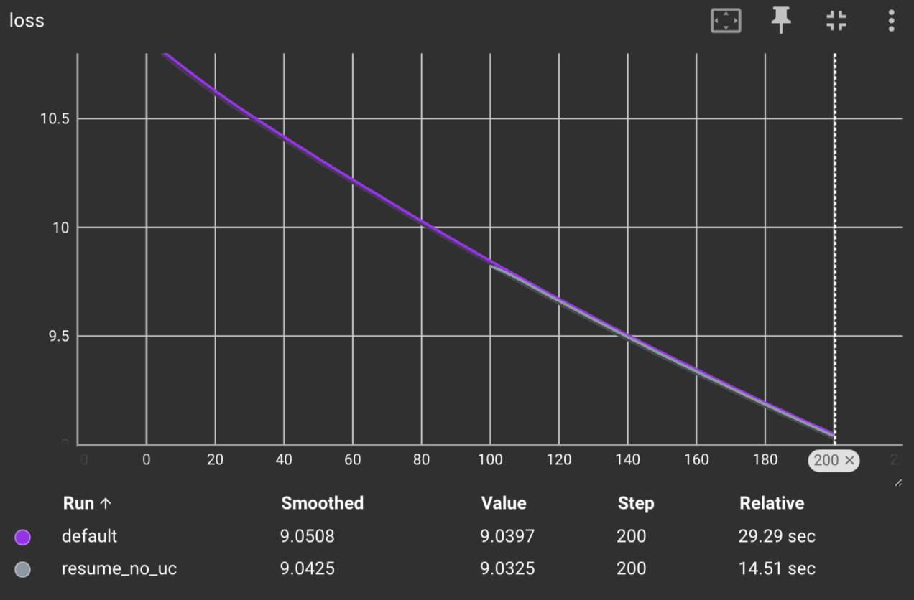
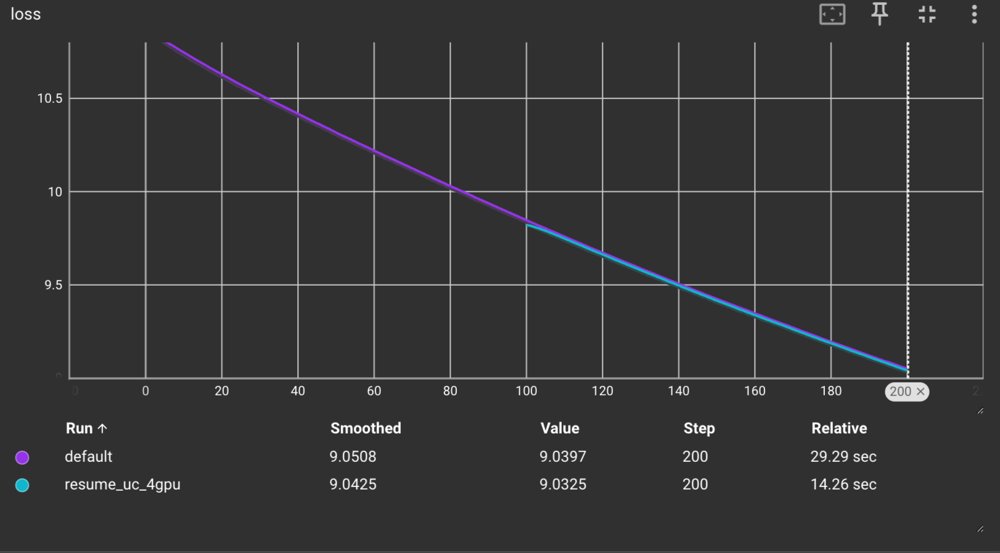
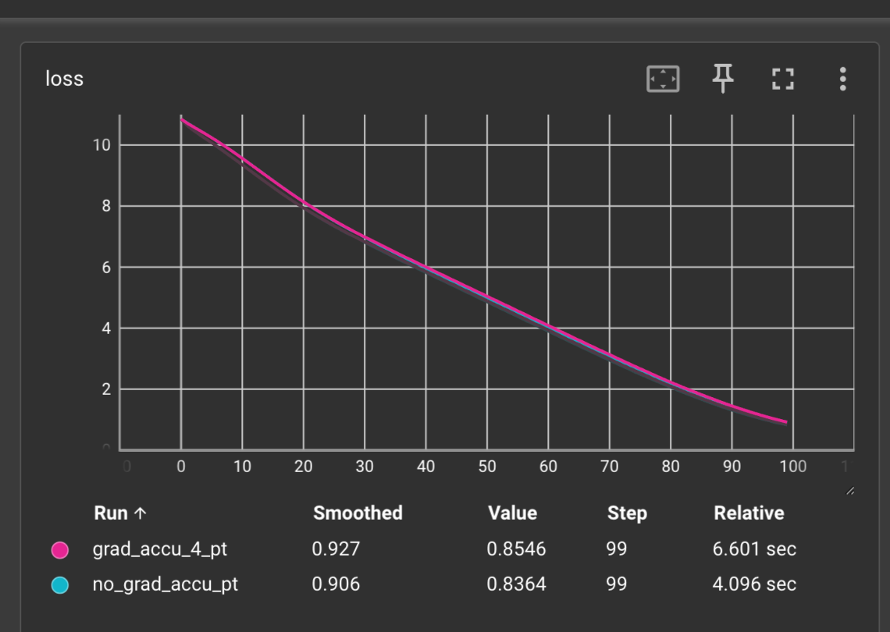
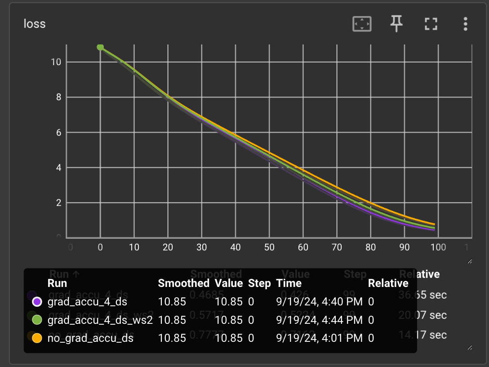

# DeepSpeed Universal Checkpoint Demo
The DeepSpeed Universal Checkpoint (UC) format is primarily designed to enable resuming experiments when the cluster size changes. In ZeRO checkpointing, optimizer and model states are divided into N shards, where N represents the number of GPUs. As a result, resuming a ZeRO checkpoint requires the same number of GPU workers as when the checkpoint was created.

Universal Checkpoint addresses this limitation by saving the model and optimizer states for each layer in separate files. This allows experiments to be resumed, even if the cluster size has changed.

Additionally, adjusting the cluster size also affects the number of gradient accumulation steps, which needs to be taken into account.

This repository provides a minimal example demonstrating how to use Universal Checkpoints when changing the cluster size and modifying gradient accumulation steps.

## Test 1. Universal checkpoint (UC) without changing cluster size 

First, do a baseline run with 200 steps on 4 GPUs. Checkpoint at every 100 
steps, we will convert ckpt 100 to universal checkpoint 
that loss tracks
```
rm -rf logs
CUDA_VISIBLE_DEVICES=0,1,2,3 deepspeed train.py --train_batch_size 256 \
    --train_micro_batch_size_per_gpu 64 --steps 200 \
    --checkpoint_dir ds_transformer_checkpoint \
    --run_name default --checkpoint_interval 100 
```

Run a sanity test to resume the trainig from step 100 with 4 GPUs using ZeRO checkpoint. 
```
CUDA_VISIBLE_DEVICES=0,1,2,3 deepspeed train.py --resume \
    --checkpoint_dir ds_transformer_checkpoint \
    --checkpoint_tag global_step100 \
    --train_batch_size 256 \
    --train_micro_batch_size_per_gpu 64 \
    --steps 200 \
    --checkpoint_interval 400 \
    --run_name resume_no_uc
```
Result of the sanity test:



To use UC, convert the zero checkpoint at step 100 to universal checkpoint 
with 
```
python ds_to_universal.py \
    --input_folder ds_transformer_checkpoint/global_step100/ \
    --output_folder ds_transformer_checkpoint/global_step100_universal \
    --num_extract_workers 4 --num_merge_workers 4  
```

Resume training with 4 GPUs with universal checkpoint
```
CUDA_VISIBLE_DEVICES=0,1,2,3 deepspeed train.py --resume \
    --checkpoint_dir ds_transformer_checkpoint \
    --checkpoint_tag global_step100_universal \
    --train_batch_size 256 \
    --train_micro_batch_size_per_gpu 64 \
    --universal_checkpoint \
    --run_name resume_uc_4gpu \
    --steps 200 \
    --checkpoint_interval 400 
```

After resuming from UC without changing the cluster size (hence 
gradient accumulation steps), the loss tracks as expected. This means
the universal checkpoint is correctly created

<Add image here> 


## Test 2. Gradient accumulation (GA) with deepspeed
### Pytorch Implementation of gradient accumulation
With vanilla pytorch, you can only call `optimizer.step` once per 
optimization step and before updating the parameter, you will need
to manually divide the gradient by gradient accumulation steps.


Baseline without gradient accumulation
```
python grad_accu_pt.py --steps 100 \
    --run_name no_grad_accu_pt \
    --train_micro_batch_size_per_gpu 32 \
    --train_batch_size 32
```

Rerun the same experiment with gradient accumulation to 4
```
python grad_accu_pt.py --steps 100 \
    --run_name grad_accu_4_pt \
    --train_micro_batch_size_per_gpu 8 \
    --train_batch_size 32
```

The loss from both experiment matchs



### DeepSpeed speed implementation of gradient accumulation 
DeepSpeed has native handling of gradient accumulation, you will 
call `model_engine.step` at every micro batch forward pass, and it
only update the weights when gradient accumulation finishes. It also
adjust the gradient without user having to to so manually. 


Run a baseline experiment without gradient accumulation
```
CUDA_VISIBLE_DEVICES=0 deepspeed grad_accu_ds.py --steps 100 \
    --run_name no_grad_accu_ds \
    --train_micro_batch_size_per_gpu 32 \
    --train_batch_size 32
```

Rerun the experiment with gradient accumulaiton to 4 without cluster 
size change
```
CUDA_VISIBLE_DEVICES=0 deepspeed grad_accu_ds.py --steps 100 \
    --run_name grad_accu_4_ds \
    --train_micro_batch_size_per_gpu 8 \
    --train_batch_size 32
```

Rerun the experiment with gradient accumulation to 2 with 2 GPUs
```
CUDA_VISIBLE_DEVICES=0,1 deepspeed grad_accu_ds.py --steps 100 \
    --run_name grad_accu_4_ds_ws2 \
    --train_micro_batch_size_per_gpu 8 \
    --train_batch_size 32
```

Loss for all the experiments above matches


## Test 3. UC + GA
In the last demo, we resume from the universal checkpoint produced in Test 1 with 2 GPUs. This means the we will double the gradient 
accumulation steps

Resume training with 2 GPUs with gradient accumulation
```
CUDA_VISIBLE_DEVICES=0,1 deepspeed train.py --resume \
    --checkpoint_dir ds_transformer_checkpoint \
    --checkpoint_tag global_step100_universal \
    --train_batch_size 256 \
    --train_micro_batch_size_per_gpu 64 \
    --universal_checkpoint \
    --run_name resume_uc \
    --steps 200 \
    --checkpoint_interval 400 
```

The loss tracks with the baseline run from test 1


